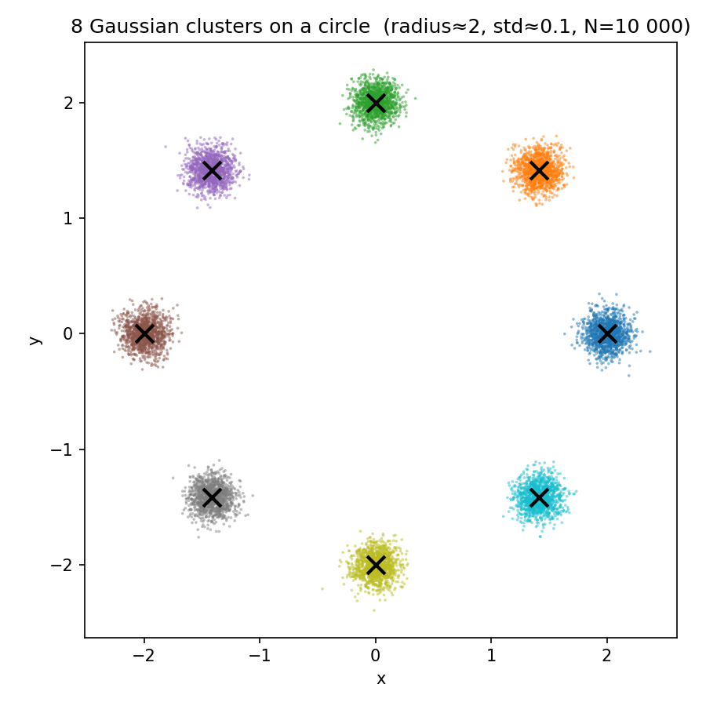
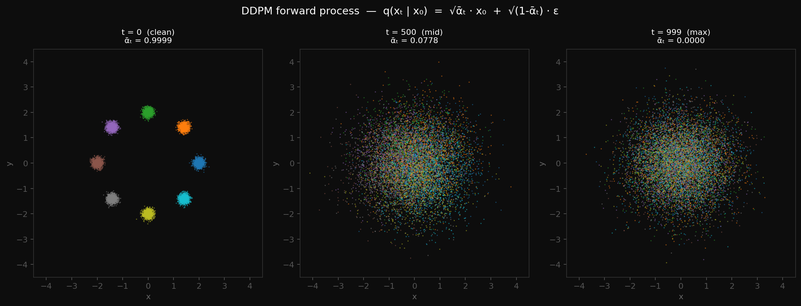
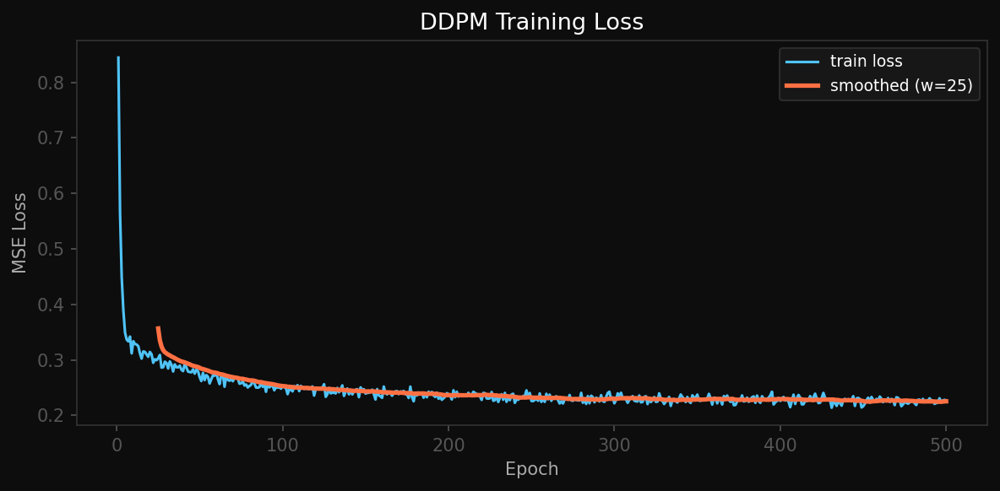
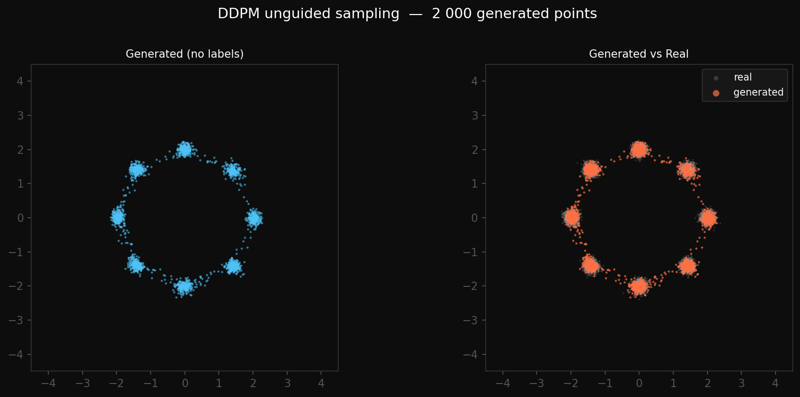

## The 8 clusters generated from data.py 


## DDPM Forward Diffusion Process, final image generated from schedule.py, used the function from data.py to generate the testing sample.



## Output of denoiser.py 
```bash
MLPDenoiser(input_dim=2, hidden_dim=256, time_emb_dim=32)
Parameters : 75,266

Input  x  : torch.Size([64, 2])
Output eps  : torch.Size([64, 2])  same shape as x
input_dim=   1  →  output torch.Size([64, 1])
input_dim=   4  →  output torch.Size([64, 4])
input_dim=  16  →  output torch.Size([64, 16])
input_dim= 128  →  output torch.Size([64, 128])
```

## Output of diffusion.py

```bash
MLPDenoiser(input_dim=2, hidden_dim=256, time_emb_dim=32)
Parameters: 75,266
Dataset size: 10,000   batch: 512   epochs: 500

 Epoch        Loss
────────────────────
     1    0.844528
    50    0.269171
   100    0.252601
   150    0.239369
   200    0.238406
   250    0.226165
   300    0.221924
   350    0.237555
   400    0.226080
   450    0.216588
   500    0.227314
────────────────────
Final loss : 0.227314
Loss curve  → /Users/ameygupta/sop_task/images/ddpm_loss.png
Checkpoint  → /Users/ameygupta/sop_task/images/ddpm_model.pt
```

## The Loss Curve generated from diffusion.py


## Output of the 2nd part of diffusion.py (after implement unguided sampling)

```bash
Running reverse diffusion (2 000 samples) ...
Generated   : torch.Size([2000, 2])
Samples plot → /Users/ameygupta/sop_task/images/ddpm_samples.png
```

## The DDPM unguided sampling 
