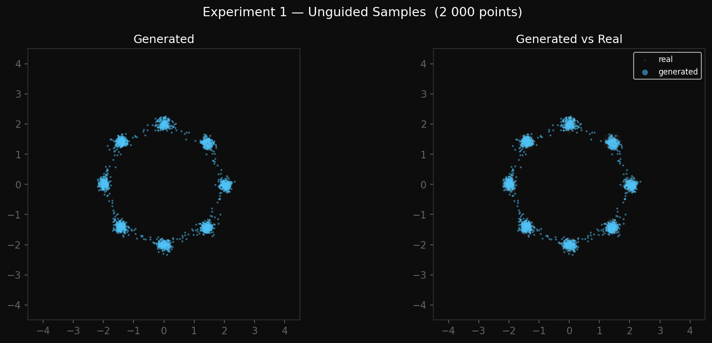
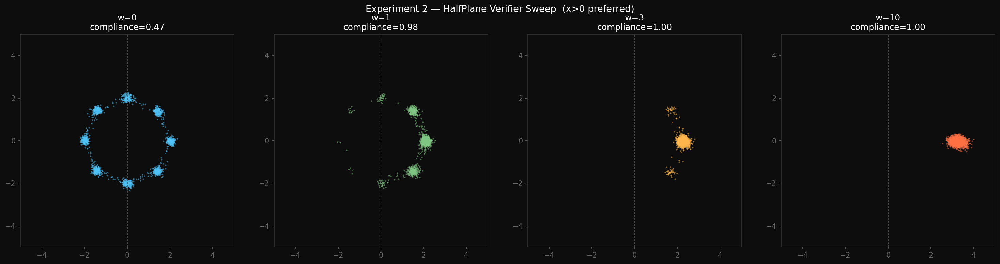
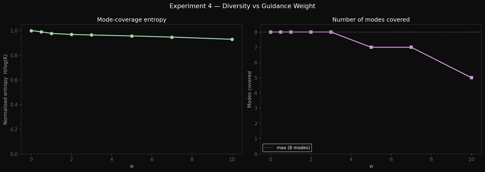
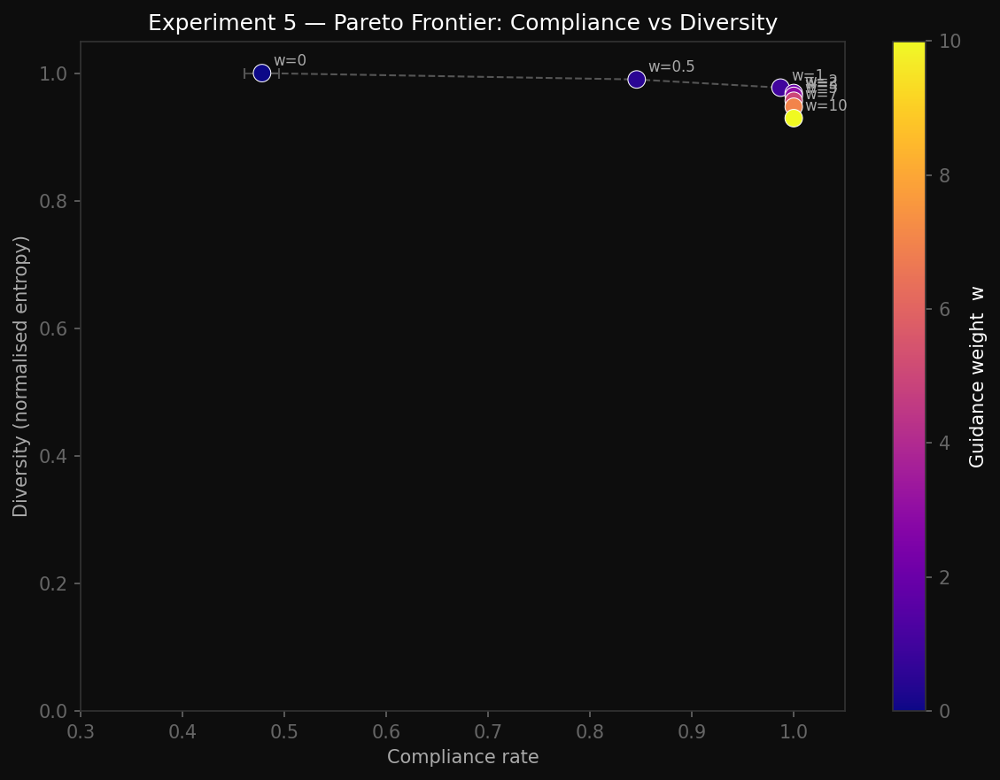
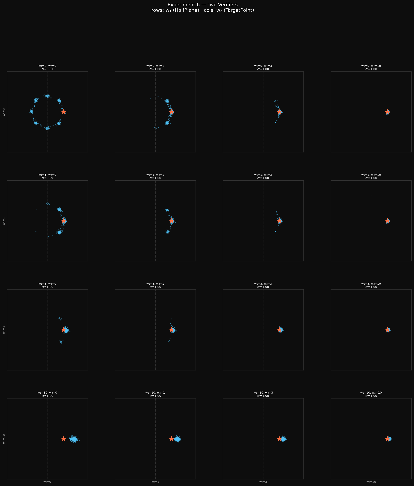

## The 8 clusters generated from data.py 


## DDPM Forward Diffusion Process, final image generated from schedule.py, used the function from data.py to generate the testing sample.


## Output of denoiser.py 
```bash
MLPDenoiser(input_dim=2, hidden_dim=256, time_emb_dim=32)
Parameters : 75,266

Input  x  : torch.Size([64, 2])
Output eps  : torch.Size([64, 2])  same shape as x
input_dim=   1  →  output torch.Size([64, 1])
input_dim=   4  →  output torch.Size([64, 4])
input_dim=  16  →  output torch.Size([64, 16])
input_dim= 128  →  output torch.Size([64, 128])
```

## Output of diffusion.py

```bash
MLPDenoiser(input_dim=2, hidden_dim=256, time_emb_dim=32)
Parameters: 75,266
Dataset size: 10,000   batch: 512   epochs: 500

 Epoch        Loss
────────────────────
     1    0.844528
    50    0.269171
   100    0.252601
   150    0.239369
   200    0.238406
   250    0.226165
   300    0.221924
   350    0.237555
   400    0.226080
   450    0.216588
   500    0.227314
────────────────────
Final loss : 0.227314
Loss curve  → /Users/ameygupta/sop_task/images/ddpm_loss.png
Checkpoint  → /Users/ameygupta/sop_task/images/ddpm_model.pt
```

## The Loss Curve generated from diffusion.py


## Output of the 2nd part of diffusion.py (after implementing unguided sampling)

```bash
Running reverse diffusion (2 000 samples) ...
Generated   : torch.Size([2000, 2])
Samples plot → /Users/ameygupta/sop_task/images/ddpm_samples.png
```

## The DDPM unguided sampling 


## Output of verifiers.py

```bash
GaussianVerifier
GaussianVerifier(mean=[0.0, 0.0], std=1.0)
log_value      : torch.Size([16])  min=-2.353  max=-0.032
grad_log_value : torch.Size([16, 2])
closed-form == autograd 

GaussianMixtureVerifier: 
GaussianMixtureVerifier(K=8, std=0.1)
log_value : torch.Size([16])  min=-199.828  max=-1.637
grad_log_value : torch.Size([16, 2])
closed-form == autograd

log_value sanity: centres vs random :
At cluster centres : 0.000  (should be HIGH)
At random points   : -492.291  (should be LOWER)
log_value higher at modes

grad sanity: gradient points toward nearest centre: 
x         = [2.5, 0.0]
∇log p(x) = [-50.0, -0.0]  (should point toward [2, 0])
gradient direction correct

HalfPlaneVerifier:
HalfPlaneVerifier(dim=2, axis=0, temperature=1.0)  # prefers right
log_value(x_left)  = [-3.0, -1.0]   ← should be low
log_value(x_right) = [1.0, 3.0]  ← should be high
bigger x → better

grad_log_value shape : torch.Size([16, 2])
gradient (first 4 rows):
tensor([[1., 0.],
        [1., 0.],
        [1., 0.],
        [1., 0.]])
gradient is constant [1, 0] for all inputs
gradient always points right
closed-form == autograd
temperature scaling correct

 TargetPointVerifier:
TargetPointVerifier(target=[2.0, 0.0], sigma=1.0)
log_value near target : [-0.004999990575015545, -0.005000000353902578]  ← high
log_value far  target : [-12.5, -17.0]  ← low
closer → better
log_value at target = -0.0000  (max = 0)
gradient · (target - x) ≥ 0 for all 16 random points
gradient = [0, 0] at target
‖grad‖ close=0.100  far=2.000  (further → stronger)
closed-form == autograd

All verifier checks passed.
```

## Output of guidance.py

```bash
Loaded checkpoint (2-D model)
HalfPlaneVerifier guidance (w=0 vs w=10)
sampling w=0
sampling w=10
mean x | w=0: -0.003   w=10: 3.257
points shift right with guidance
Saved → /Users/ameygupta/sop_task/images/guidance_halfplane.png

TargetPointVerifier guidance (w=0 vs w=10)
sampling w=0
sampling w=10
mean distance to target | w=0: 2.531   w=10: 0.106
points move closer to target with guidance
Saved → /Users/ameygupta/sop_task/images/guidance_targetpoint.png

All guidance checks passed
```

## Output of metrics.py

```bash
compliance_rate
perfect samples   right-half: 0.478
right-only        right-half: 0.874
noise             right-half: 0.495

mode_coverage
perfect samples  coverage: 1.000
right-only       coverage: 0.988
noise samples    coverage: 1.000

modes_covered
perfect samples  modes covered: 8 / 8
right-only       modes covered: 4 / 8

wasserstein_2d
W2(perfect, perfect)       = 0.0000
W2(perfect, shifted)       = 3.0000
W2(perfect, noise)         = 1.4266

Backend: POT (exact)

 All metrics checks passed.
 ```

 ### Resulting Images of the 6 experiments conducted in notebooks/01_toy_experiments.ipynb

## Exp1:
 

## Exp2:
 

## Exp3:
 

## Exp4:
 

## Exp5:
 

## Exp6:
 